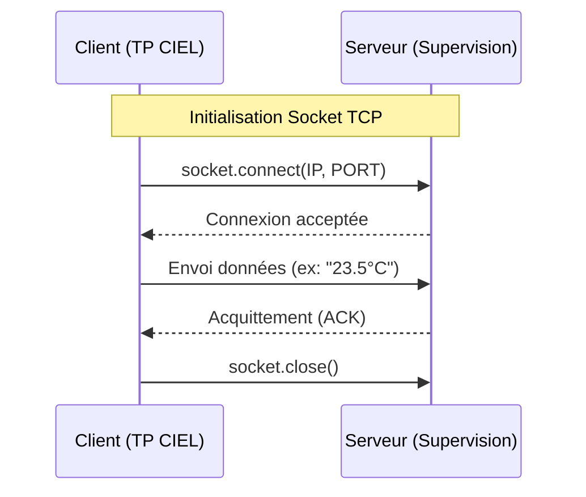

# BTS CIEL 2027 - Programmation Réseau (Sockets Python)

Ce dépôt est dédié à l'étude et à l'évolution du script **`Demo_socket.py`**, utilisé pour comprendre les échanges de données en couche Transport (TCP/UDP).

## 📂 Fichier principal : Demo_socket.py

Le script `Demo_socket.py` sert de base pour l'apprentissage de la communication entre un client (ex: capteur, Raspberry Pi) et un serveur de supervision.

### Fonctionnalités implémentées :
*   Initialisation de sockets TCP/IP.
*   Gestion des flux de données (encodage/décodage UTF-8).
*   Simulation d'acquisition de données (mesures de tension/température).

---

## 🛠️ Cycle de développement (Workflow Git)

À chaque modification du script (ajout de la gestion d'erreurs, boucles infinies, etc.), suivez cette procédure pour sauvegarder vos versions :

### 1. Préparation (Stage)
Après avoir modifié `Demo_socket.py`, ajoutez-le à l'index :
```bash
git add Demo_socket.py
```

### 2. Validation (Commit)
Enregistrez l'étape atteinte. Utilisez des messages clairs pour identifier l'évolution :
```bash
# Exemple pour l'ajout de la gestion d'exception
git commit -m "Fix: Ajout du bloc try/except pour la connexion"
```

### 3. Mise à jour distante (Push)
Envoyez vos modifications vers GitHub :
```bash
git push origin main
```

---

## 🚀 Utilisation du script

Pour exécuter le script dans l'environnement de TP :

1. **Lancer le serveur** (ou le simulateur) :
   
```bash
   python3 Demo_socket.py --mode server
   ```

2. **Lancer le client** dans un second terminal :
   
```bash
   python3 Demo_socket.py --mode client
   ```

---

## 📊 Architecture du flux de données

Voici le cycle de vie d'une connexion dans `Demo_socket.py` :


---

### Pourquoi ce choix ?
*   **Focus unique :** En limitant le README à ce seul fichier, vous évitez de perdre les étudiants dans des dossiers superflus.
*   **Historique lisible :** Les instructions de `commit` incitent les élèves à documenter *pourquoi* ils changent le code (ex: "Ajout du calcul de checksum").
*   **Visualisation immédiate :** Le diagramme Mermaid permet de faire le lien entre le code Python (`socket.connect`) et le concept théorique du "Three-way handshake".
