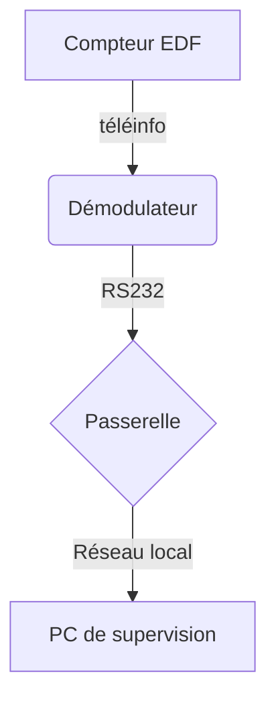
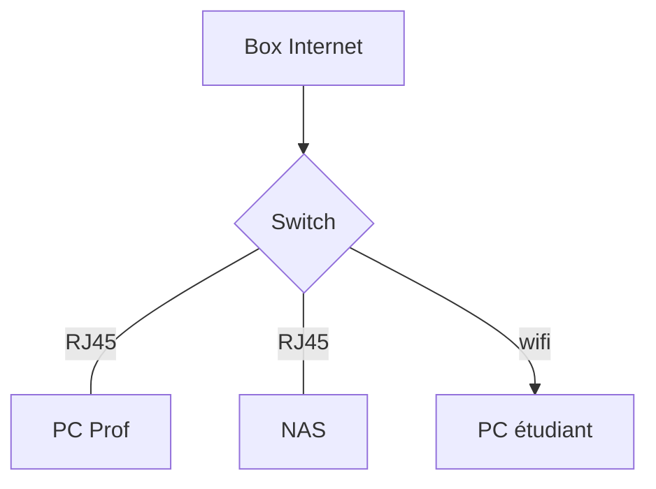
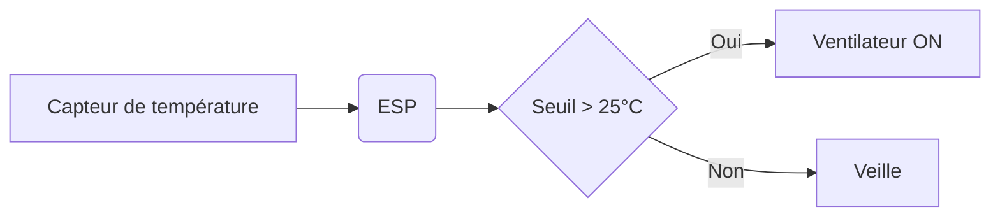
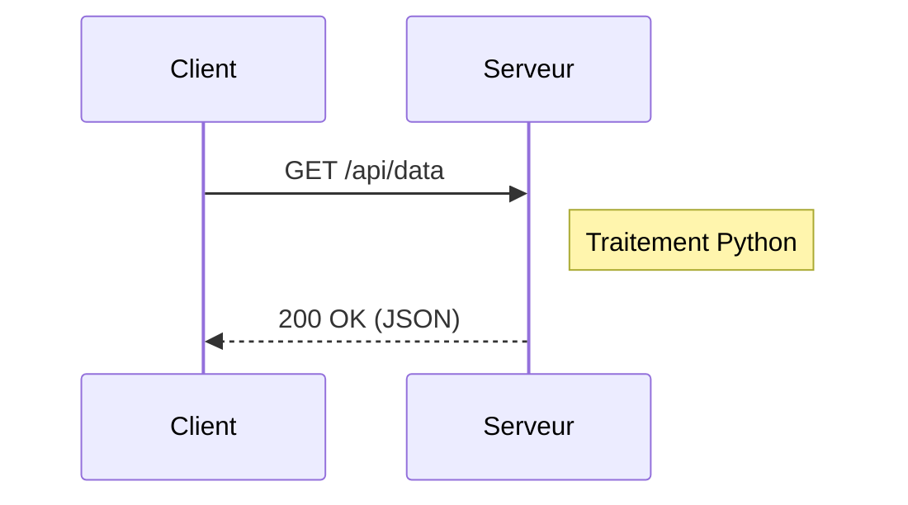
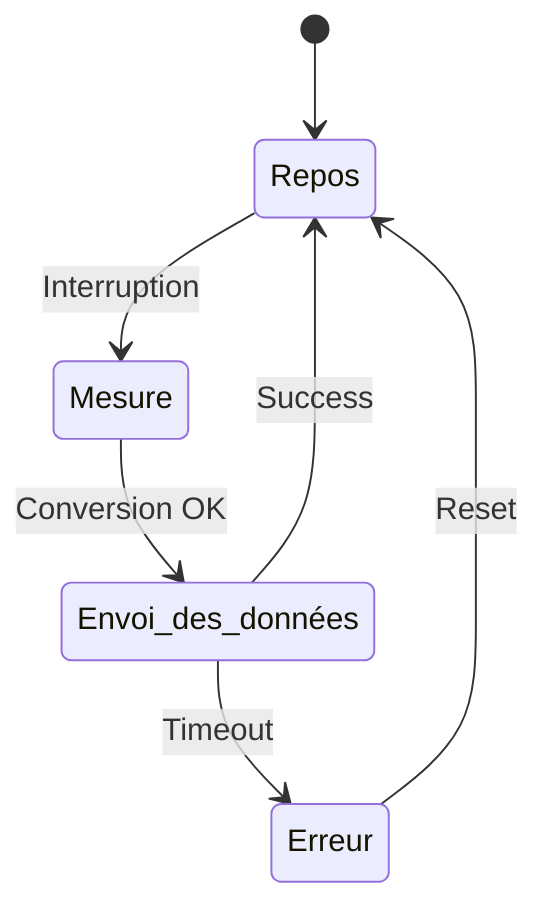

# Titre du projet
## Installation
### Configuration du réseau

**Présentation** des *concepts généraux*

#### A. Insertion de code Python
```python
import socket
# Exemple de client TCP
s = socket.socket(socket.AF_INET, socket.SOCK_STREAM)
```

#### B. Tableaux
Exemple avec une table d'adresses IP
```markdown
|-----------|------------|--------|
| Interface | Adresse IP | Masque |
|-----------|------------|--------|
| eth0      | 192.168.1.1| /24    |
| wlan0     | 10.0.0.5   | /16    |
|-----------|------------|--------|
```

#### C. Formules mathématiques et scientifiques
$U = R \times I$

$$v(t) = \int_{t_0}^{t} a(t)dt + v(t_0)$$

#### D. Listes
##### 1. Puces
* **Démodulateur** : Convertisseur Téléinfo / RS232
* **Passerelle CIE_H10** : Serveur de trames téléinfo sur le réseau local
* **Oscilloscope numérique** : Visualisation des trames téléinfo

##### 2. Enumérations
Procédure de mise en service du système
1. Vérifier la tension d'alimentation
2. Connecter le câble série
3. Lancer le terminal

##### 3. Cases à cocher
- [x] Initialiser le dépôt local avec `git init`
- [x] Vérifier les paramètres réseau
- [ ] Programmer le Timeout de la socket dans `Demo_socket.py` 
- [ ] Tester la récupération des trames avec le programme client

#### E. Diagrammes
##### 1. Verticaux




##### 2. Horizontaux


##### 3. De séquence


##### 4. D'état

